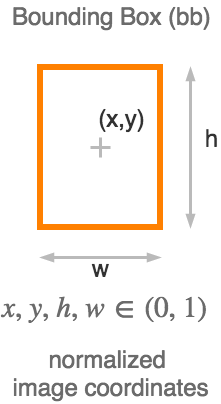

# FSOCO
<small>Formula Student Objects in Context</small>

## What?
Open-Source Dataset for Objects that need to be recognized during the dynamic disciplines of the Formula Student Driverless competitions.


| Team  | Data Type  | Annotation Type  | # Data | # Cones |
|---|---|---|---|---|
| municHMotorsport e.V.  | Color Images  | Darknet YOLO Format | 3745 | 18697 |
| Elbflorace e.V.  |  Color Images |  Darknet YOLO Format | 853 | 3791 |
| SCUTRacing  |  Color Images |  Darknet YOLO Format | 792 | 5896 |
| DHBW Engineering e.V.  |  Color Images |  VOC | 600 | 5794 |
|   |   |   |||
|   |   |   |||
|   |   |   |||

### Annotation Types

Here you'll find the definitions for all different annotation types appearing in the datasets. If you need the labels in another format, please look for the according script in the [scripts folder](https://github.com/ddavid/fsoco/tree/master/scripts) or write one and share your solution - sharing is caring ;)

#### Darknet YOLO

Darknet uses normalized image dimensions for the labels and defines the regions-of-interest (ROI) by their **class**, **mid-point**, **width** and **height**



```bash
# darknet-label.txt

0 0.255078125 0.545833333333 0.02421875 0.0583333333333
0 0.41328125 0.613194444444 0.040625 0.0819444444444
0 0.81015625 0.780555555556 0.0734375 0.15
```

[class index][mid_x][mid_y][width][height]

#### VOC

VOC is a xml based description format.
A label will be similiar to:

```xml
<object>
    <name>yellow-cone</name>
    <pose>Unspecified</pose>
    <truncated>0</truncated>
    <difficult>0</difficult>
    <polygon>
        <x1>877</x1>
        <y1>571</y1>
        <x2>897</x2>
        <y2>528</y2>
        <x3>916</x3>
        <y3>576</y3>
    </polygon>
</object>
```

VOC can be converted to Darknet YOLO by using the script provided in this repo.
DHBW Engineering used polygons for marking the cones.
An example:


## Who?
* [municHMotorsport e.V.](https://www.munichmotorsport.de/)  

<a href="https://www.munichmotorsport.de/"></a>

* [Elbflorace e.V](https://www.elbflorace.de/en/)  

<a href="https://www.elbflorace.de/en/"></a>
* [SCUTRacing](http://www.scutracing.com/)  
<a href="http://www.scutracing.com/"></a>
* [DHBW Engineering e.V.](https://dhbw-engineering.de/) 

<a href="https://dhbw-engineering.de/"></a>

*...

## Why?
Open-Source Dataset to accelerate the development of (camera-based) solutions for **Object Detection** in the context of the Formula Student Driverless competitions.
Collecting raw data and annotating it accordingly is important, but is not feesible to be done well enough by one team within the time constraints of the competition.
